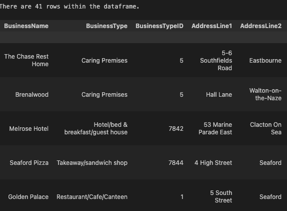
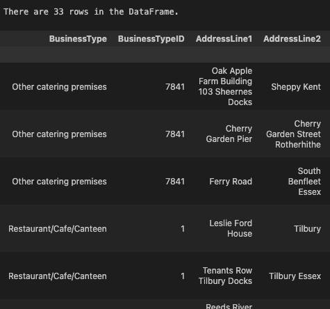
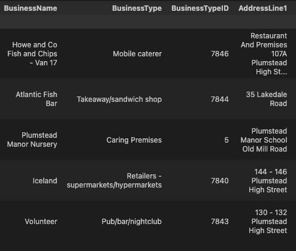
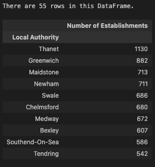

# nosql-challenge

The purposes of this exercise include performing CRUD (Create, Read, Update, Delete) operations on a NoSQL database and analyzing the results to answer specific questions about establoshments in the UK.

## Part One (located in NoSQL_setup_starter.ipynb):

The database called uk_food was created and populated by importing a json file into MongoDB. The resulting collection is called establishments. A missing halal restaurant called Penang Flavours was added to the database and was used as a reference for most of the analysis. Due to it missing partial data (specifically the BusinessTypeID), the entire database was queried to locate the equivalent of "Restaurant/Cafe/Canteen" used on other records, since this was the classification of Penang Flavours.

The database was further updated by converting the longitude and latitude to floats and the RatingValue to integers instead of strings.

## Part Two (located in NoSQL_analysis_starter.ipynb):

### Which establishments have a hygiene score equal to 20?

### Which establishments in London have a RatingValue greater than or equal to 4?

### What are the top 5 establishments with a RatingValue of 5, sorted by lowest hygiene score, nearest to the new restaurant added, "Penang Flavours"?

### How many establishments in each Local Authority area have a hygiene score of 0? Sort the results from highest to lowest, and print out the top ten local authority areas.

